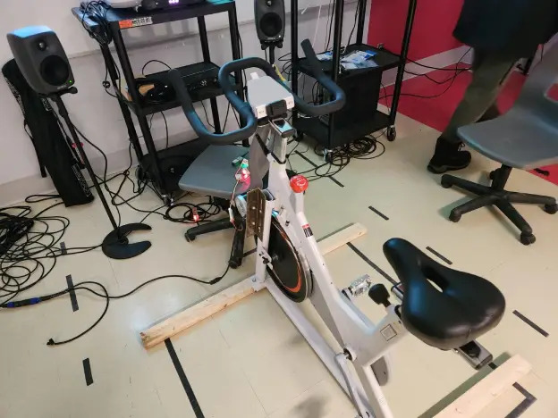
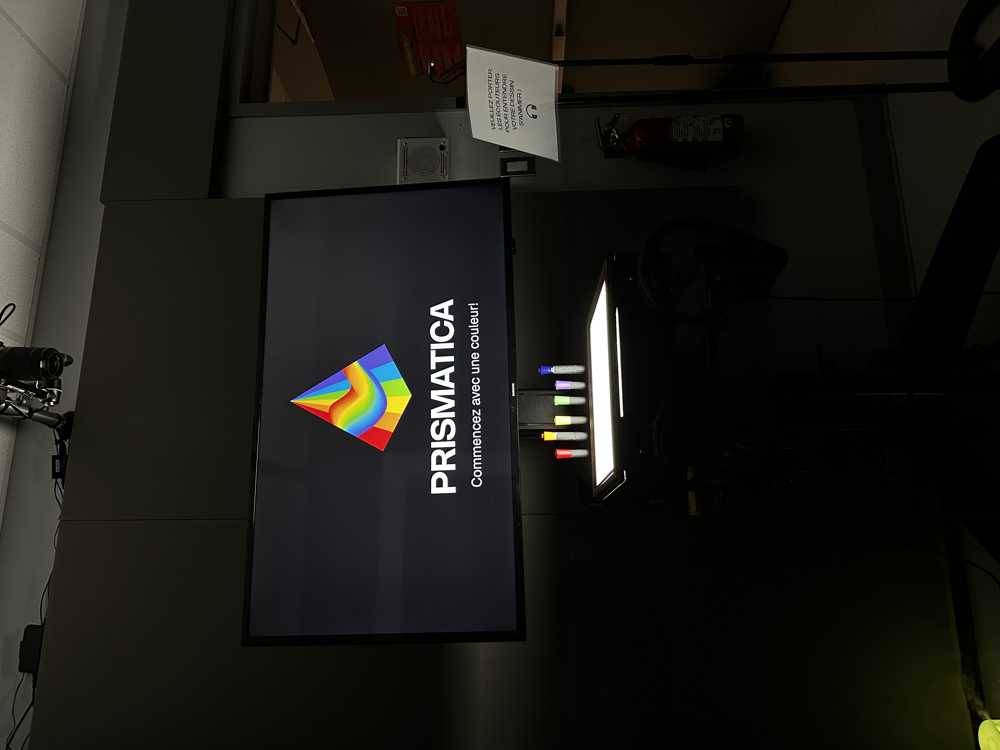

# Autres projets explorés - documentation collective

## 1. Web-C0N-DU8

- **Créateurs et créatrices :** Gearshift Games (https://gearshift-games.github.io/Web-C0N-DU8/#/)
- **Installation dans les studios :**
  
- **Schéma de plantation :**
  
  *Source : Documentation GitHub du projet*
- **Expérience personnelle :**
  Avant l'expérience, j'étais intrigué par l'univers cyberpunk et son esthétique. Après y avoir joué, j'ai apprécié la richesse visuelle et l'intelligence du gameplay projeté. L'interaction par bouton physiques et détection de gestes était immersive.

## 2. Luminatura

- **Créateurs et créatrices :** Miaou Mafia (https://miaou-mafia.github.io/projet-luminatura/#/)
- **Installation dans les studios :**
  
- **Schéma de plantation :**
  
  *Source : Documentation GitHub du projet*
- **Expérience personnelle :**
  Cette installation lumineuse inspirée du monde végétal m'a charmée. Avant d'entrer, je ne savais pas à quoi m'attendre. En touchant les feuilles électroniques et en voyant la lumière réagir, j'ai ressenti une connexion intime avec l'oeuvre. Le lien entre nature et technologie est très poétique.

## 3. Etheria

- **Créateurs et créatrices :** Ethereal Creators (https://ethereal-creators.github.io/Etheria/#/)
- **Installation dans les studios :**
  
- **Schéma de plantation :**
  
  *Source : GitHub Etheria*
- **Expérience personnelle :**
  Une ambiance flottante, contemplative. Le dispositif sonore spatial et les formes abstraites donnent une expérience presque méditative. J'ai ressenti du calme, un ralentissement du temps. L'utilisation de la projection et de la spatialisation est impressionnante.

## 4. Fuga

- **Créateurs et créatrices :** Escapism Fuga (https://escapism-fuga.github.io/Fuga/#/)
- **Installation dans les studios :**
  
- **Schéma de plantation :**
  
  *Source : GitHub*
- **Expérience personnelle :**
  Très fort sur le plan narratif et auditif. L'oeuvre nous fait voyager dans un monde intime, presque onirique. Avant d'y entrer, j'avais une attente floue. Après coup, j'ai trouvé que l'univers sonore était le coeur de l'oeuvre, appuyé par une projection sobre mais évocatrice.

## 5. Arcadia

- **Créateurs et créatrices :** Cousi Cousa (https://cousi-cousa.github.io/Arcadia/#/)
- **Installation dans les studios :**
  
- **Schéma de plantation :**
  
  *Source : GitHub Arcadia*
- **Expérience personnelle :**
  Arcadia présente une dimension ludique intéressante. Il y a une coopération nécessaire entre les visiteurs, ce qui crée une interaction sociale. L'installation est très colorée, dynamique. J'ai aimé la combinaison entre action physique et réponse lumineuse.

## 6. Prismatica

- **Créateurs et créatrices :** Poot Pookies (https://pootpookies.github.io/Prismatica/#/)
- **Installation dans les studios :**
  
- **Schéma de plantation :**
  
  *Source : GitHub Prismatica*
- **Expérience personnelle :**
  Ce projet m'a surpris par sa simplicité efficace. Les interactions lumineuses et colorées sont bien synchronisées. Il y a un effet hypnotique, presque enfantin. Une belle exploration de la lumière et de la géométrie.

---

## Compétences essentielles (cours du programme)

1. **420-V11-MO Programmation interactive** : Utilisation de capteurs, interaction temps réel, Arduino, TouchDesigner.
2. **582-3B4-MO Projet de fin d'études** : Pour développer un projet immersif complet (scénarisation, technique, design).
3. **420-2B4-MO Programmation Web créative** : Toutes les expos sont accompagnées d'une documentation GitHub. La présentation Web du projet est cruciale.

## Composante technologique nouvelle : Spatialisation sonore 3D (Etheria)

Je ne connaissais pas bien la spatialisation sonore 3D. C'est une technique qui consiste à placer virtuellement les sons dans un espace tridimensionnel pour créer une immersion auditive totale. Utilisée dans Etheria, elle permet de "ressentir" les sons autour de soi, selon sa position. On peut la réaliser avec des outils comme Max/MSP, Wwise ou Unity (AudioMixer avec HRTF). Elle est très utile pour les installations immersives et les jeux vidéo.

---

*Fiche rédigée en mars 2025 - documentation collective d'exposition*
