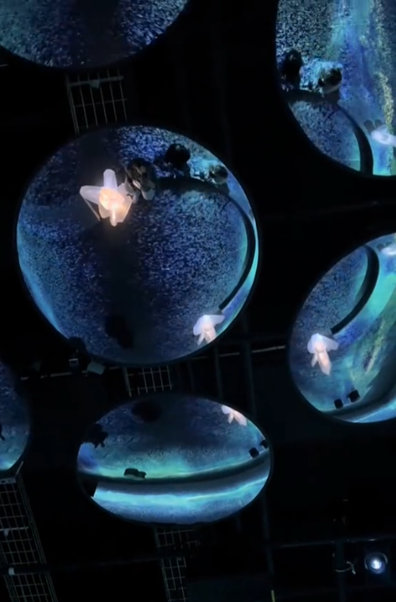

# <ins>OASIS Apesanteur</ins>

*Vue de l'une des salles immersives du parcours « Apesanteur »*

## OASIS immersion (Palais des Congrès de Montréal)

Exposition immersive et temporaire visitée en avril 2025.  
Lien vers l’exposition officielle : [https://oasis.im/apesanteur/](https://oasis.im/apesanteur/)

*Moi-même, à l'intérieur de l'installation lumineuse d’OASIS Apesanteur*

## Description de l'œuvre immersive

Apesanteur est une exposition sensorielle immersive proposée par OASIS immersion, à Montréal. L’œuvre invite à la déconnexion du monde réel par des projections vidéo à 360°, des sons enveloppants et des atmosphères visuelles flottantes. On explore l’état de **l’apesanteur émotionnelle**, à travers des univers visuels inspirés de l’espace, de l’eau, de la lumière et du silence.

L’expérience se fait dans plusieurs salles successives :  
- Une salle d’introduction avec narration  
- Une salle d’immersion où des gouttes de lumière tombent comme de la pluie  
- Une salle plafond miroir avec des méduses lumineuses et projections circulaires  

Chaque espace évoque la légèreté, la suspension, la fluidité.

.png)

*Effets visuels simulant une pluie lumineuse descendant des murs*

*Vue du plafond interactif – formes aquatiques/méduses lumineuses projetées*

🎥 Vidéos prises sur place :  
- [Vidéo 1](./medias/videos/oasis_apesenteur.mp4)  
- [Vidéo 2](./medias/videos/oasis_apesenteur (2).mp4)  
- [Vidéo 3](./medias/videos/oasis_apesenteur (3).mp4)  
- [Vidéo officielle de l'exposition (YouTube)](https://www.youtube.com/watch?v=ce_KIcBHrtY)

---

## Composantes techniques de l’installation

- **Projection vidéo 360°** sur murs et plafond
- **Plafond miroir** + supports suspendus pour diffusion des images
- **Système audio immersif** multicanal (sons environnementaux, voix narrée)
- **Sol interactif** avec lumière réactive
- **Capteurs de mouvement** pour certaines zones
- **Contrôle central automatisé** via serveurs multimédia

---

## Appréciation personnelle et expérience vécue

L’expérience était **surréelle**. J’ai ressenti un vrai détachement de l’espace réel, surtout dans la salle avec les méduses lumineuses. La lumière se reflétait de tous côtés, et les sons étaient très doux, comme si j’étais sous l’eau ou flottant dans l’espace.

Ce qui m’a particulièrement **plu**, c’est l’ambiance. On n’est pas bombardé de stimuli comme dans d’autres expos numériques ; ici, tout invite à **ralentir**, à **respirer**. C’est rare qu’une exposition immersive prenne autant son temps sans chercher à impressionner à tout prix.

Ce qui m’a **moins plu**, c’est le fait que certaines zones n’étaient pas interactives alors qu’elles en donnaient l’impression. J’aurais aimé pouvoir déclencher moi-même certaines réactions visuelles avec mes mouvements.

---

## En lien avec d’autres œuvres vues cette session

- Comme *Au bord du Lac Tranquille*, cette installation travaille l'interaction lumière-espace, mais **sans nécessiter de mouvement direct** (comme patiner).
- Elle me rappelle aussi *Camp Wakonda*, mais à l’inverse : ici, il y a peu de narration concrète, tout est **sensoriel et abstrait**.
- Par sa forme circulaire et son ambiance lente, elle évoque l’œuvre *Ravel Ravel Interval* où la perception du temps et du son est centrale.

---

## Conclusion

Cette œuvre m’a rappelé que **ralentir** et **vivre un moment simple et immersif** peut être tout aussi marquant qu’une installation interactive complexe. J’en retiens une approche très pure de l’immersion : pas besoin d’interfaces ou de gadgets – juste de la lumière, du son, et du temps.

---
