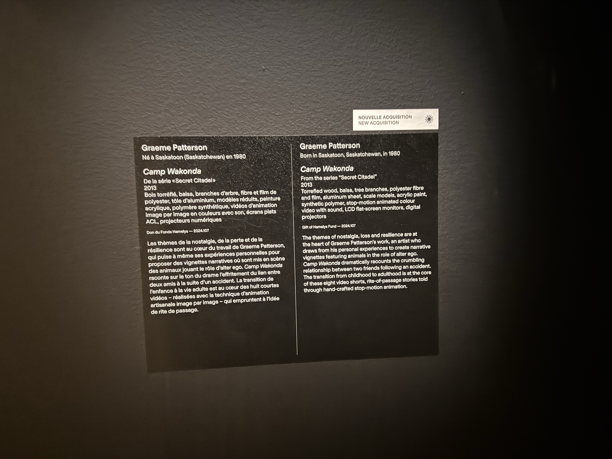

# Camp Wakonda

## Musée des Beaux-Arts de Montréal

- **Type d'exposition :** Intérieure, temporaire
- **Date de visite :** Mars 2025

### Informations sur l'œuvre

- **Titre :** Camp Wakonda
- **Artiste :** Graeme Patterson
- **Année :** 2013
- **Série :** Secret Citadel

.jpg)

### Description

Camp Wakonda explore les thèmes de la nostalgie, de la perte et de la résilience à travers des scènes miniatures et des animations stop-motion. L'installation représente la rupture d'une amitié entre deux personnages après un accident, symbolisant le passage de l'enfance à l'âge adulte.

.jpg)

### Type d'installation

- Immersive
- Contemplative

.jpg)

### Mise en espace

L'œuvre occupe une salle sombre avec plusieurs structures miniatures placées sur des lits superposés. L'éclairage ciblé met en évidence les éléments principaux.

- Vue d'ensemble
- Vue latérale
- Vue rapprochée

.jpg)

### Composantes et Techniques

- Bois torréfié, balsa
- Branches d'arbre
- Fibre, film polyester
- Aluminium
- Modèles réduits
- Peinture acrylique, polymère synthétique
- Animations stop-motion
- Écrans plats ACL
- Projecteurs numériques

### Éléments de mise en exposition

- Lits superposés (socle)
- Éclairage précis
- Écrans intégrés
- Projecteurs
- Câblage discret

### Expérience vécue

L'installation invite à une exploration détaillée, renforcée par des vidéos en stop-motion apportant une dimension narrative et émotionnelle.

https://github.com/user-attachments/assets/c4ef08bc-3227-46e9-b2a0-be894083de7b

### Appréciation personnelle

J'ai apprécié la manière dont Patterson utilise des éléments familiers (lits, scènes de camp) pour évoquer des sujets profonds comme l'amitié, la perte et la maturité. L'aspect artisanal des animations donne une authenticité unique à l'œuvre, inspirante par sa combinaison de sculpture, narration et médias numériques.
